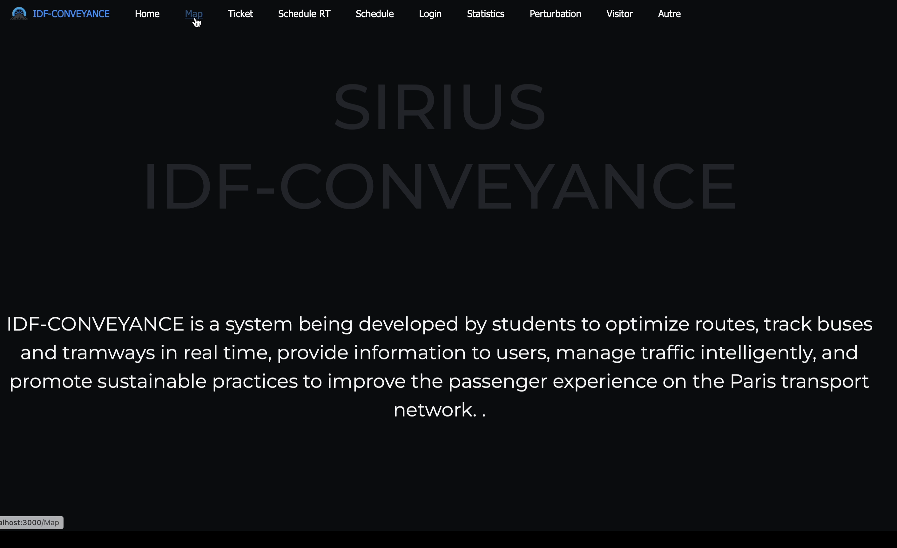
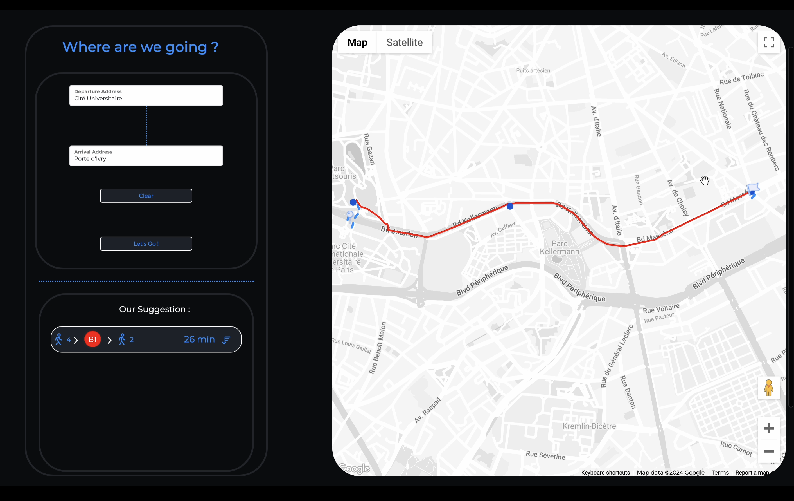
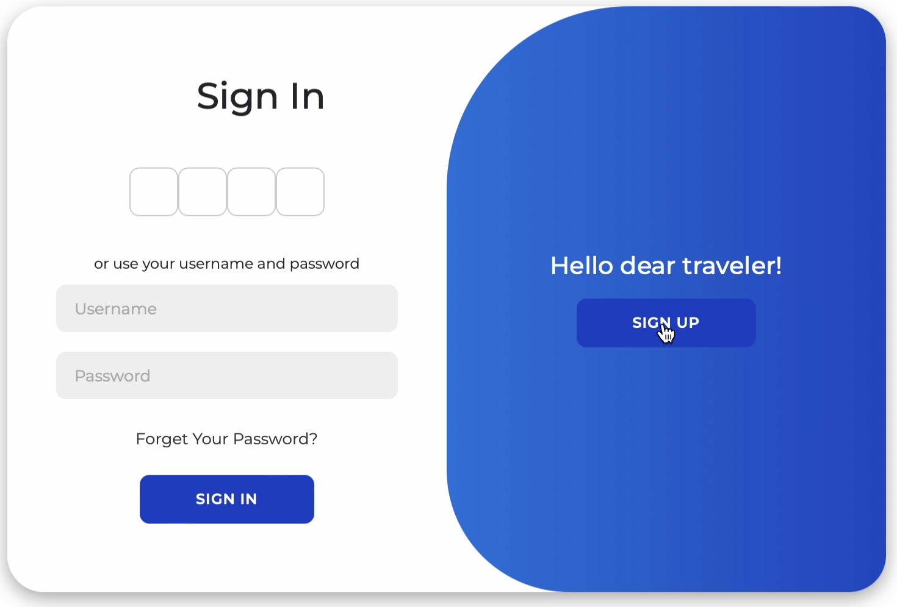
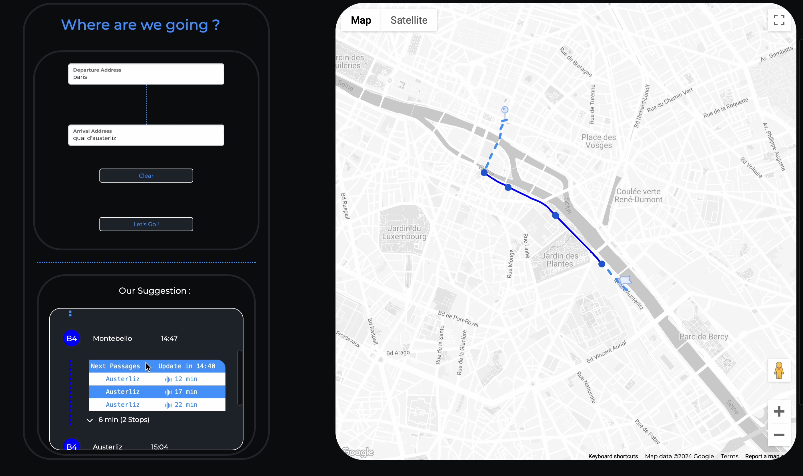

# 🚍 IDF-Conveyance

**IDF-Conveyance** is a full-stack application developed by engineering students designed to manage and optimize public transportation services (buses and tramways) in the Île-de-France region. It offers tools for route management, vehicle tracking, schedule optimization, and operational monitoring.

## 🛠️ Tech Stack

### Backend:
- **Java (Spring Boot)** – main microservices and core business logic
- **RESTful APIs** – communication between services and frontend

### Frontend:
- **React.js** – dynamic user interface and real-time interactions

### Database:
- **MySQL** – relational data storage

### DevOps & CI/CD:
- **GitLab CI**, **Jenkins** – automated testing and deployment pipelines
- **Docker** – containerization
- **Kubernetes** – microservice orchestration
- **Shell Scripting** – automation scripts
- **VMs & AWS** – deployment environments

## 📦 Features

- ✅ Multi-entity transportation management (bus, tramway)
- ✅ Real-time route tracking and updates
- ✅ Admin panel for operators and transport authorities
- ✅ Microservice-based architecture for modularity and scalability
- ✅ CI/CD pipelines with unit/integration testing
- ✅ Deployment in containerized environments via Kubernetes

## 🔄 Development Workflow

- Agile methodology (Scrum)
- Daily standups, sprint planning, reviews
- Managed using **Jira** and **Confluence** for documentation

## 📸 Screenshots

## 🚀 Deployment

The application is deployed in a private cloud environment for testing and development purposes.

## 👨‍💻 Contributors

- **Badr El Abbady** – Full-stack Developer & Data Engineer  
- **Marouane Aghbalou** – Full-stack Developer & Data Engineer  
- **Chaymae El Haouari** – Full-stack Developer & Data Engineer  
